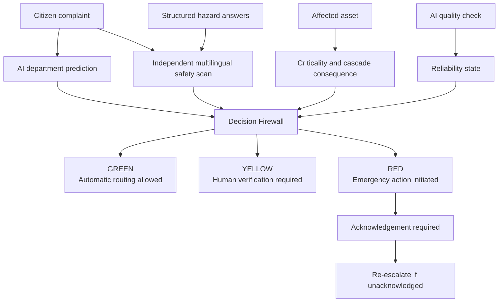
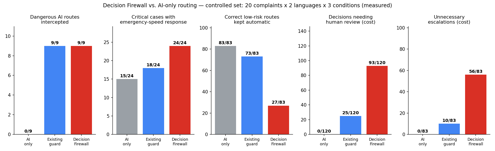

# Silent Cascade Decision Firewall

[](https://silent-cascade.streamlit.app/)
[](https://www.python.org/)
[](https://streamlit.io/)
[](https://sdgs.un.org/goals/goal11)
[](#)

> A consequence-aware safety controller for AI-routed civic infrastructure complaints.

**Silent Cascade** prevents a digital routing mistake from becoming a physical infrastructure failure. It independently evaluates danger, uncertainty, AI reliability, and infrastructure consequences before allowing an AI-generated routing decision to control an operational action.

Built for the **Manipal Hackathon — Round 1**, under the theme **“Cascading Failure: When One Failure Becomes Many”**, with a focus on disaster resilience, critical infrastructure, and UN SDG 11.

## Live demo

### [Launch the Silent Cascade Decision Firewall →](https://silent-cascade.streamlit.app/)

For the guided demonstration:

1. Select **① The dangerous miss** to see a hazardous Kannada complaint incorrectly handled by the AI-only path.
2. Select **② A routine complaint** to verify that the Firewall does not escalate every case.
3. Select **③ Nobody accepts it** to demonstrate acknowledgement monitoring and re-escalation.

The demo includes four sections:

- **Live intervention** — follow a complaint from submission to operational action.
- **Evidence** — compare the AI-only workflow, existing guard, and Decision Firewall.
- **Scenario explorer** — simulate how failure consequences change by affected asset.
- **Methodology & limitations** — distinguish observed, inferred, assumed, measured, and simulated information.

---

## The problem

A citizen reports a sparking transformer in Kannada.

The grievance-routing AI receives only part of the complaint, fails to identify the correct department, and sends the case to a routine maintenance queue. From the software’s perspective, everything appears healthy: the request completed, no exception was raised, and the system returned a response.

But the decision itself was unsafe.

If the complaint concerns a critical asset, a routine routing delay can allow the equipment to fail. Load may shift to neighbouring substations, hospitals may move to backup power, and water infrastructure may lose service.

Traditional monitoring answers:

> Did the AI respond successfully?

Silent Cascade asks a more important question:

> If this decision is wrong, how dangerous is the consequence?

---

## The solution

Silent Cascade introduces a deterministic **Decision Firewall** between an AI classifier and the operational system.

The AI proposes a route. The Firewall independently decides how much authority that proposal should receive.



### Decision levels

| Decision | AI authority | Operational response |
|---|---|---|
| **Green** | Automatic routing allowed | The AI route proceeds normally |
| **Yellow** | Advisory only | Human verification is required before final routing |
| **Red** | AI route overridden | Emergency action begins immediately while human review runs in parallel |

### Core safety principles

- **The original complaint is preserved.** The safety scan reads the complete submitted text, even when the AI receives a truncated version.
- **The safety path is independent.** It does not trust or reuse the AI prediction.
- **Unknown risk is not low risk.** Missing predictions, unavailable quality signals, or absent asset context cannot silently become Green.
- **Consequences affect autonomy.** The same uncertain prediction receives stricter treatment when it concerns critical infrastructure.
- **Mandatory hazards override scores.** Sparking, live wires, electric shock, and fire can force a Red decision.
- **Routing is not resolution.** Red incidents require acknowledgement and are re-escalated when nobody responds.

---

## Canonical demonstration

The primary scenario shows how a seemingly small AI failure can produce a large operational consequence.

```text
Kannada complaint
"Sparks are coming from the transformer box and it smells like burning."
        │
        ▼
AI receives only the first 40 characters
        │
        ▼
AI prediction: unparseable
Proposed route: general maintenance
Assumed response time: 336 hours
        │
        ▼
Independent scan reads the complete complaint
Detected: electrical sparking + burning + immediate danger
        │
        ▼
Affected asset: LR Bande Substation
Criticality: rank 2 of 190
Potential exposure: 2,729,047 simulated service population
        │
        ▼
AI reliability state: degraded
Safe mode activated
        │
        ▼
RED — IMMEDIATE EMERGENCY DISPATCH
Electrical emergency route · P1 priority
Human review runs in parallel
Acknowledgement required
```

Under the stated scenario assumptions:

- **AI-only workflow:** response occurs at 336 hours, at or after the assumed failure window, so the initiating failure and cascade occur.
- **Decision Firewall:** emergency response occurs at 4 hours, before the assumed failure window, preventing the initiating failure.

These outcomes are simulated and should not be interpreted as predictions of Bengaluru’s real electrical network.

---

## Key capabilities

### Independent multilingual hazard detection

The safety path scans the complete English or Kannada complaint and combines textual evidence with structured intake answers.

It can identify hazards such as:

- Electrical sparking
- Fire or burning
- Live wires
- Electric shock
- Burst pipes
- Active flooding
- Explicit immediate danger

### Consequence-aware routing

The Firewall considers the affected asset’s:

- Criticality rank and percentile
- Service population
- Connected substations
- Hospitals dependent on the feeder
- Water-service dependencies
- Assumed repair and failure windows

### AI reliability control

A controlled quality check determines whether the AI is operating normally or under degraded conditions.

When reliability degrades, the Firewall enters **safe mode** and restricts automatic routing instead of waiting for a total system failure.

### Acknowledgement and escalation

A Red decision produces a simulated emergency work order with:

- Assigned department
- Priority
- Response target
- Acknowledgement deadline
- Parallel human review
- Re-escalation to the control-room supervisor when unacknowledged

### Auditable decisions

Every decision includes explicit reason codes, such as:

- `DIRECT_HAZARD`
- `DANGEROUS_DOWNGRADE`
- `VERY_HIGH_ASSET_CRITICALITY`
- `REPAIR_WINDOW_AT_RISK`
- `RELIABILITY_DEGRADED`
- `UNPARSEABLE_CLASSIFICATION`
- `LOW_MARGIN`
- `TRUNCATED_CLASSIFIER_INPUT`

---

## Evaluation

The controlled evaluation contains:

- 20 synthetic complaints
- 2 languages: English and Kannada
- 3 AI input conditions
- 120 evaluated cases
- 5 policy configurations

The primary comparison is:

| Metric | AI only | Existing guard | Decision Firewall |
|---|---:|---:|---:|
| Dangerous AI routes intercepted | 0 / 9 | 9 / 9 | **9 / 9** |
| Critical cases receiving an emergency-speed response | 15 / 24 | 18 / 24 | **24 / 24** |
| Correct low-risk routes kept automatic | **83 / 83** | 73 / 83 | 27 / 83 |
| Decisions requiring human review | **0 / 120** | 25 / 120 | 93 / 120 |
| Unnecessary escalations | **0 / 83** | 10 / 83 | 56 / 83 |

The results show the intended trade-off: the Decision Firewall catches every dangerous downgrade and gives every critical case an emergency-speed response, but increases human-review workload during degraded AI conditions.

The Firewall is therefore a safety policy, not a free accuracy improvement.



See [LIMITATIONS.md](LIMITATIONS.md) for denominators, provenance, claim boundaries, and guidance on interpreting these results.

---

## Technology stack

- **Python 3.11**
- **Streamlit** — interactive demonstration
- **Pandas and NumPy** — evaluation and data processing
- **NetworkX** — infrastructure graph and cascade simulation
- **Matplotlib** — evaluation and sensitivity visualizations
- **Leaflet and OpenStreetMap** — interactive asset and cascade map
- **PyYAML** — configuration and policy parameters
- **Pytest** — policy, simulation, evaluation, and application tests

The application does not require an external AI API or API key. The classifier used in this prototype is a deterministic bilingual keyword-based proxy designed to make the safety-controller behaviour reproducible.

---

## Run locally

### Prerequisites

- Python 3.11
- Git

### Installation

```bash
git clone https://github.com/Powel29/silent-cascade-demo.git
cd silent-cascade-demo
git switch demo-assets

python -m venv .venv
```

Activate the environment:

```bash
# Windows PowerShell
.venv\Scripts\Activate.ps1
```

```bash
# macOS or Linux
source .venv/bin/activate
```

Install the dependencies:

```bash
python -m pip install --upgrade pip
pip install -r requirements.txt
```

Start the application:

```bash
streamlit run app.py
```

Then open:

```text
http://localhost:8501
```

All files required by the interactive demo are included in the repository. Network access is only required for loading map tiles or re-fetching OpenStreetMap data.

---

## Reproduce the analysis

The repository contains the cached datasets and generated outputs used by the demo.

```bash
# Rebuild the processed infrastructure graph
python src/build_graph.py

# Generate the criticality ranking and cascade assets
python src/d1_cascade.py

# Run the topology and headroom sensitivity analysis
python src/d1_robustness.py

# Run the controlled bilingual classifier experiment
python src/d2_language.py

# Evaluate all Decision Firewall configurations
python src/evaluate_firewall.py

# Run the test suite
python -m pytest tests/ -q
```

Re-fetching OpenStreetMap data is optional. The application and tests use the cached repository data by default.

---

## Repository structure

```text
silent-cascade-demo/
├── app.py
│   Streamlit application and interactive demonstration
│
├── config.yaml
│   Simulation assumptions and Decision Firewall policy
│
├── src/
│   ├── cascade.py
│   │   Corrected cascading-failure simulation
│   ├── decision_firewall.py
│   │   Risk assessment, policy decisions, and action plans
│   ├── evaluate_firewall.py
│   │   Comparative policy evaluation
│   ├── d2_language.py
│   │   Reproducible English/Kannada classifier baseline
│   ├── build_graph.py
│   │   Infrastructure graph construction
│   ├── fetch_data.py
│   │   Optional OpenStreetMap data collection
│   ├── d1_cascade.py
│   │   Criticality ranking and cascade outputs
│   └── d1_robustness.py
│       Sensitivity analysis
│
├── data/
│   ├── complaints.csv
│   │   Synthetic bilingual evaluation complaints
│   ├── scenarios.csv
│   │   Explicit complaint-to-asset demo mappings
│   ├── raw/
│   │   Cached OpenStreetMap layers
│   └── processed/
│       Processed nodes, edges, and infrastructure graph
│
├── outputs/
│   Evaluation tables, decision traces, charts, and simulation assets
│
├── tests/
│   Cascade, Firewall, evaluation, and Streamlit smoke tests
│
├── docs/
│   Detailed application documentation
│
├── LIMITATIONS.md
│   Claim boundaries, provenance, and known limitations
│
└── requirements.txt
    Reproducible Python dependencies
```

---

## Data and evidence provenance

Silent Cascade explicitly distinguishes different evidence types.

| Label | Meaning in this project |
|---|---|
| **Observed** | Infrastructure locations obtained from OpenStreetMap |
| **Inferred** | Network topology constructed from proximity and graph rules |
| **Assumed** | Loads, capacities, buffers, response times, and policy thresholds |
| **Synthetic** | Complaints, ground-truth labels, and complaint-to-asset mappings |
| **Measured** | Results calculated on the controlled evaluation set |
| **Simulated** | Cascade outcomes produced by the infrastructure model |
| **Cited** | External context supported by references listed in the documentation |

Every numerical assumption is centralized in [`config.yaml`](config.yaml).

---

## Testing

The test suite covers:

- Cascade load conservation and state transitions
- Decision Firewall policy rules
- Mandatory Red hazard overrides
- Missing-data behaviour
- Reliability degradation and safe mode
- Comparative evaluation counts
- Canonical scenario behaviour
- Streamlit application smoke tests
- Acknowledgement and re-escalation
- Escaping of rendered complaint text

Run all tests with:

```bash
python -m pytest tests/ -q
```

---

## Scope and limitations

This repository is a scenario-based prototype.

It is:

- A demonstration of consequence-aware AI governance
- A deterministic safety controller around an AI-like routing layer
- An auditable comparison of different operational policies
- A simulation of how routing delays could interact with infrastructure consequences

It is not:

- A production emergency-response system
- A production machine-learning model
- A digital twin of Bengaluru’s electrical grid
- A prediction of real outages or affected populations
- A source of official municipal response-time commitments
- A system that dispatches crews, sends messages, or changes real infrastructure

The locations are based on OpenStreetMap, but the topology is inferred, operational loads are assumed, complaint mappings are synthetic, and physical outcomes are simulated.

Read [`LIMITATIONS.md`](LIMITATIONS.md) before using the project’s numerical results outside the context of this demonstration.

---

## Responsible-use statement

Silent Cascade is designed to demonstrate a safety architecture, not to automate real emergency decisions.

Any production implementation would require:

- Validated multilingual hazard models
- Independent and representative quality-monitoring data
- Utility-approved asset and network information
- Calibrated uncertainty estimates
- Human-factors and workload evaluation
- Security and privacy review
- Clear departmental ownership
- Auditable escalation procedures
- Field testing with emergency and infrastructure professionals

Human oversight remains essential, particularly for high-consequence decisions.

---

## Documentation

- [Streamlit application guide](docs/STREAMLIT_APP.md)
- [Limitations and claim boundaries](LIMITATIONS.md)
- [Implementation plan](PLAN.md)
- [Configuration and policy assumptions](config.yaml)
- [Canonical decision trace](outputs/decision_trace.json)
- [Evaluation results](outputs/firewall_evaluation.csv)
- [Condition-level evaluation](outputs/firewall_evaluation_by_condition.csv)

---

## Deployment

The public demonstration is hosted on Streamlit Community Cloud:

**https://silent-cascade.streamlit.app/**

Deployment configuration:

```text
Repository: Powel29/silent-cascade-demo
Branch:     demo-assets
Entrypoint: app.py
Python:     3.11
```

No secrets or external API credentials are required.

---

## Attribution

Map data © [OpenStreetMap contributors](https://www.openstreetmap.org/copyright), available under the Open Database License.

Code, synthetic complaints, evaluation design, and simulation assets were created for the Silent Cascade hackathon submission.

---

## Team

**Silent Cascade Team**  
Manipal Hackathon — Round 1  
Disaster Resilience and Critical Infrastructure · UN SDG 11