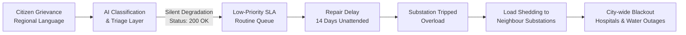

# Silent Cascade: When Silent AI Degradation Triggers Physical Infrastructure Collapse

[](#)
[](#)
[](#)

> **Manipal Hackathon (M#) — Round 1 Submission**  
> **Problem Statement:** *Cascading Failure: When One Failure Becomes Many*  
> **Domain:** Disaster Resilience & Critical Infrastructure (UN SDG 11)

---

## Executive Summary

Modern smart cities invest heavily in monitoring physical assets—electrical substations, distribution lines, water pumping stations, and emergency hospitals. However, almost **nothing monitors the AI routing layer** that decides which citizen grievances get escalated and repaired first.

In municipal grievance pipelines, AI triage systems can degrade silently:
1. A citizen logs an emergency grievance (e.g., an arcing transformer or fallen live wire) in a regional language (e.g., Kannada script).
2. The AI classifier silently misclassifies the urgency or department due to linguistic degradation, truncation, or low-capacity models.
3. The municipal ops system registers a successful **HTTP 200** with normal latency; all operational health dashboards stay **100% green**.
4. The ticket is assigned a low-priority routine maintenance SLA instead of emergency dispatch.
5. Days later, the physical asset fails under load, triggering a **cascading power grid overload and water supply blackout** across the city.

**Silent Cascade** proves this failure mode using real spatial infrastructure data from Bengaluru, an experimental linguistic routing benchmark, a physical cascade simulator, an intervention analysis illustrating the **Butterfly Effect**, and — going a step further — a working **verification checkpoint and decision-quality monitor** that closes the loop back into the physical network: a ₹1.5L human verification checkpoint on AI decisions cuts mean cascade impact by ~31% (≈460,000 fewer people affected across 100 paired runs), while a ₹85L single-substation hardware hardening barely moves it (<1%).

---

## The Failure Chain



---

## Two ways to explore this project

| | What it is | Best for |
|---|---|---|
| **[`app.py`](app.py) — Interactive prototype (Streamlit)** | A live app calling the project's real Python functions (`cascade()`, `classify_one()`, `route_with_guard()`, `run_condition()`) — nothing is reimplemented for the UI. Runs locally or deployed on Streamlit Community Cloud. | Judges who want to change inputs and see the actual pipeline respond — the PLAN.md §A.5 bonus prototype. |
| **[`outputs/dashboard/index.html`](outputs/dashboard/index.html) / [`outputs/d3_dashboard.html`](outputs/d3_dashboard.html)** | Static, self-contained HTML snapshots (one is a frozen copy of a Claude-Artifact-hosted interactive page; the other is the standalone D3 "all-green monitor" mock). No Python required — open directly in a browser. | Slides, video recording, or anyone without Python installed. |

Both read from the same `outputs/*.csv` and `config.yaml` — there is one source of truth.

**Live deployment:** _add your Streamlit Community Cloud URL here once deployed (see [Deploying the prototype](#deploying-the-prototype))._

---

## The interactive prototype (`app.py`)

Four sections, each a thin UI layer over existing pure functions — so every number the app shows is provably the same computation that produced the committed `outputs/*.csv` files:

### Overview
The pitch, the failure chain, and a **live** "no alarm fired" split test: a CivicOps monitor (uptime, latency, error rate, requests/min, six "operational" services) that drifts and ticks in real time — entirely in the browser, no page reruns — right next to what the classifier actually did to complaint `c01`. A provenance table lists every metric in the app as Observed / Inferred / Assumed / Synthetic / Measured / Simulated.

### Cascade simulator
Pick any of Bengaluru's 190 real substations as the initiating failure. A self-contained Leaflet map (real OpenStreetMap tiles) plays the cascade timeline client-side — play/pause, scrub, speed control, fit-to-network, hover tooltips with each node's failure time — with a live HUD (people affected, hospitals on generator, wards without water, substations tripped). Below it, the full criticality ranking: which substation's failure, alone, cascades to the whole network.

### Language routing — the AI injection, traced end to end
This is the core "fix," not just the demonstration:
1. **The decision** — the real `classify_one()` keyword-baseline classifier (not a production LLM — labelled as such) routes one complaint under a chosen language/condition, with matched keywords highlighted.
2. **The routing guard** — `route_with_guard()` is a concrete verification checkpoint: unparseable or low-confidence decisions are sent to a 48-hour verification queue (a field-officer verify/assign window — an assumption, see config.yaml) instead of a routine queue, and safety keywords impose an urgency floor. Shown side by side: "today, no guard" vs. "with guard."
3. **What that delay does to the network** — the guarded/unguarded repair SLA is checked against the time-to-failure, and the *actual* `cascade()` engine runs to show people affected with and without the guard, on the real network.
4. **Decision monitor** — `canary_report()` continuously re-probes a 20-complaint golden set in both languages and alarms when native-script accuracy diverges from English by more than a configured threshold — the canary CivicOps never had.

### Intervention comparison
Recomputes the D4 Monte Carlo comparison live (adjustable run count): baseline vs. hardening the top-ranked substation vs. the verification checkpoint, with cost annotations.

---

## Running the prototype locally

```bash
pip install -r requirements.txt
streamlit run app.py
```

Requires `data/processed/graph.gpickle`, `data/complaints.csv`, and `outputs/d1_criticality.csv` / `d2_accuracy.csv` / `d2_results.csv` / `d4_summary.csv` to already exist — see [Running the offline pipeline](#running-the-offline-pipeline) if you're starting from a fresh clone. All of these are committed to the repo, so `git clone` + the two commands above is enough; no Overpass fetch needed.

## Deploying the prototype

1. Push this repo (or your fork) to GitHub.
2. On [share.streamlit.io](https://share.streamlit.io), create an app pointing at your repo, the branch you're deploying, and main file `app.py`. Dependencies install automatically from `requirements.txt`.
3. Once live, test the URL **on a phone over mobile data** before submitting — the map is the heaviest part of the page.

---

## Deliverables & Pipeline Architecture (D1–D4)

The offline pipeline produces four demonstration deliverables configured via [config.yaml](config.yaml):

| ID | Asset | Source Script | Primary Output | Description |
|---|---|---|---|---|
| **D1** | **Cascade Simulation** | [`src/d1_cascade.py`](src/d1_cascade.py) | [`outputs/d1_cascade_scenario_a.gif`](outputs/d1_cascade_scenario_a.gif), [`outputs/d1_criticality.csv`](outputs/d1_criticality.csv) | Physics-based load-redistribution failure cascade across Bengaluru's spatial power and water network. |
| **D2** | **Language Experiment** | [`src/d2_language.py`](src/d2_language.py) | [`outputs/d2_chart.png`](outputs/d2_chart.png), [`outputs/d2_results.csv`](outputs/d2_results.csv) | Empirical benchmark of 120 triage decisions measuring accuracy gaps between English and Kannada under clean, truncated, and lightweight model conditions. Also home to `route_with_guard()` and `canary_report()`, used live by `app.py`. |
| **D3** | **"All-Green" Ops Monitor** | [`src/d3_dashboard.py`](src/d3_dashboard.py) | [`outputs/d3_dashboard.html`](outputs/d3_dashboard.html) | Synthetic municipal telemetry UI demonstrating that service monitoring reports healthy status while fatal decision errors occur. |
| **D4** | **Intervention Analysis** | [`src/d4_intervention.py`](src/d4_intervention.py) | [`outputs/d4_comparison.png`](outputs/d4_comparison.png), [`outputs/d4_summary.csv`](outputs/d4_summary.csv) | Monte Carlo simulation (100 runs) comparing physical hardware hardening vs. an upstream AI verification checkpoint. |

`app.py` (the interactive prototype) sits on top of all four — it does not duplicate their logic.

---

## Data Provenance & Methodological Honesty

Every datum in this project is explicitly labeled with its provenance (see also the Overview page's live provenance table):

| Component | Source / Methodology | Provenance Label |
|---|---|---|
| **Substation Coordinates (190)** | OpenStreetMap query (`power=substation`) over Bengaluru bounding box | **Observed** |
| **Hospital & Pump Coordinates (1,217)** | OpenStreetMap queries (`amenity=hospital`, `man_made=water_works\|pumping_station`) | **Observed** |
| **Power Feeder Topology** | $k$-Nearest Neighbors ($k=3$) on Haversine distance | **Inferred** |
| **Electrical Capacities & Loads** | Uniform bounded sampling from [`config.yaml`](config.yaml) | **Assumed** |
| **Hospital / Water Buffers** | Standard engineering baselines (8.0h generator fuel, 6.0h reservoir buffer) | **Assumed** |
| **Complaint Texts (20)** | Native Kannada script and English civic grievance dataset | **Synthetic** |
| **Routing Accuracy Metrics** | Deterministic 120-run experimental evaluation | **Measured** |
| **Cascade Dynamics & Criticality** | Physics-based load shedding simulation in [`src/cascade.py`](src/cascade.py) | **Simulated** |
| **Verification-queue SLA (48h)** | Field-officer verify/assign window; no verified Karnataka (BESCOM/BWSSB) figure available | **Assumed** |
| **Other department SLAs, time-to-failure, guard thresholds** | Illustrative municipal SLA values in [`config.yaml`](config.yaml) | **Assumed** |
| **Intervention Cost Estimates** | Order-of-magnitude representative figures for policy comparison | **Assumed** |

---

## Directory Structure

```
silent-cascade-demo/
├── README.md                      # Project documentation and guide
├── CLAUDE.md                      # Technical build specification
├── PLAN.md                        # Context, competition strategy, and core argument
├── config.yaml                    # Single source of truth for numeric assumptions
├── requirements.txt                # Python package dependencies (offline pipeline + app.py)
├── app.py                         # Interactive Streamlit prototype (PLAN.md §A.5 bonus)
├── .streamlit/
│   └── config.toml                # Dark theme for the Streamlit app
├── data/
│   ├── raw/                       # Cached Overpass API JSON responses (never re-fetched)
│   ├── complaints.csv             # 20 hand-written civic complaints, English + Kannada
│   └── processed/                 # Generated node/edge CSVs and network graphs
├── src/
│   ├── fetch_data.py              # OpenStreetMap Overpass data extractor
│   ├── build_graph.py             # Spatial network builder & topology generator
│   ├── cascade.py                 # Pure-function cascading failure engine
│   ├── d1_cascade.py              # D1 pipeline: runs cascade & generates GIF/PNG frames
│   ├── d2_language.py             # D2 pipeline + classify_one/route_with_guard/canary_report
│   ├── d3_dashboard.py            # D3 pipeline: generates CivicOps monitor HTML
│   └── d4_intervention.py         # D4 pipeline: Monte Carlo intervention analysis
└── outputs/                       # Final artifacts, charts, CSVs, and dashboards
    ├── d1_cascade_scenario_a.gif  # Animated cascade simulation
    ├── d1_criticality.csv         # Substation vulnerability ranking
    ├── d2_chart.png               # Language accuracy bar chart
    ├── d2_results.csv             # Full 120 classification records
    ├── d3_dashboard.html          # Standalone all-green ops monitor HTML
    ├── d4_comparison.png          # Intervention comparison chart
    ├── d4_summary.csv             # Intervention statistical summary
    └── dashboard/
        ├── index.html             # Static snapshot of the interactive showcase
        └── assets/                # Supporting images and static media
```

---

## Getting Started

### Prerequisites
* Python 3.10 or higher
* Modern web browser (Chrome, Firefox, Safari, Edge)

### Installation
1. Clone the repository and navigate to the project directory:
   ```bash
   cd silent-cascade-demo
   ```
2. Create and activate a virtual environment:
   ```bash
   python -m venv venv
   # On Windows:
   .\venv\Scripts\activate
   # On macOS/Linux:
   source venv/bin/activate
   ```
3. Install required dependencies:
   ```bash
   pip install -r requirements.txt
   ```

### Running the prototype
```bash
streamlit run app.py
```
All the data it needs is already committed to the repo (see [Running the offline pipeline](#running-the-offline-pipeline) only if you want to regenerate it from scratch).

### Running the offline pipeline
Run the end-to-end simulation scripts in sequence to regenerate everything in `outputs/` from scratch:

```bash
# 1. Fetch real infrastructure geometry (cached to data/raw/)
python src/fetch_data.py

# 2. Construct topological graph and node attributes
python src/build_graph.py

# 3. Generate D1 cascade animations and criticality rankings
python src/d1_cascade.py

# 4. Run D2 language-stratified triage evaluation
python src/d2_language.py

# 5. Build D3 CivicOps monitoring mockup
python src/d3_dashboard.py

# 6. Execute D4 intervention Monte Carlo simulation
python src/d4_intervention.py
```

### Viewing the static dashboards
Open the HTML files directly in your web browser — no Python required:
* **Interactive showcase (static snapshot)**: [`outputs/dashboard/index.html`](outputs/dashboard/index.html)
* **CivicOps Monitor mock**: [`outputs/d3_dashboard.html`](outputs/d3_dashboard.html)

---

## License & Attribution
* Built for **Manipal Hackathon (M#)**.
* Map data &copy; [OpenStreetMap](https://www.openstreetmap.org/copyright) contributors.
